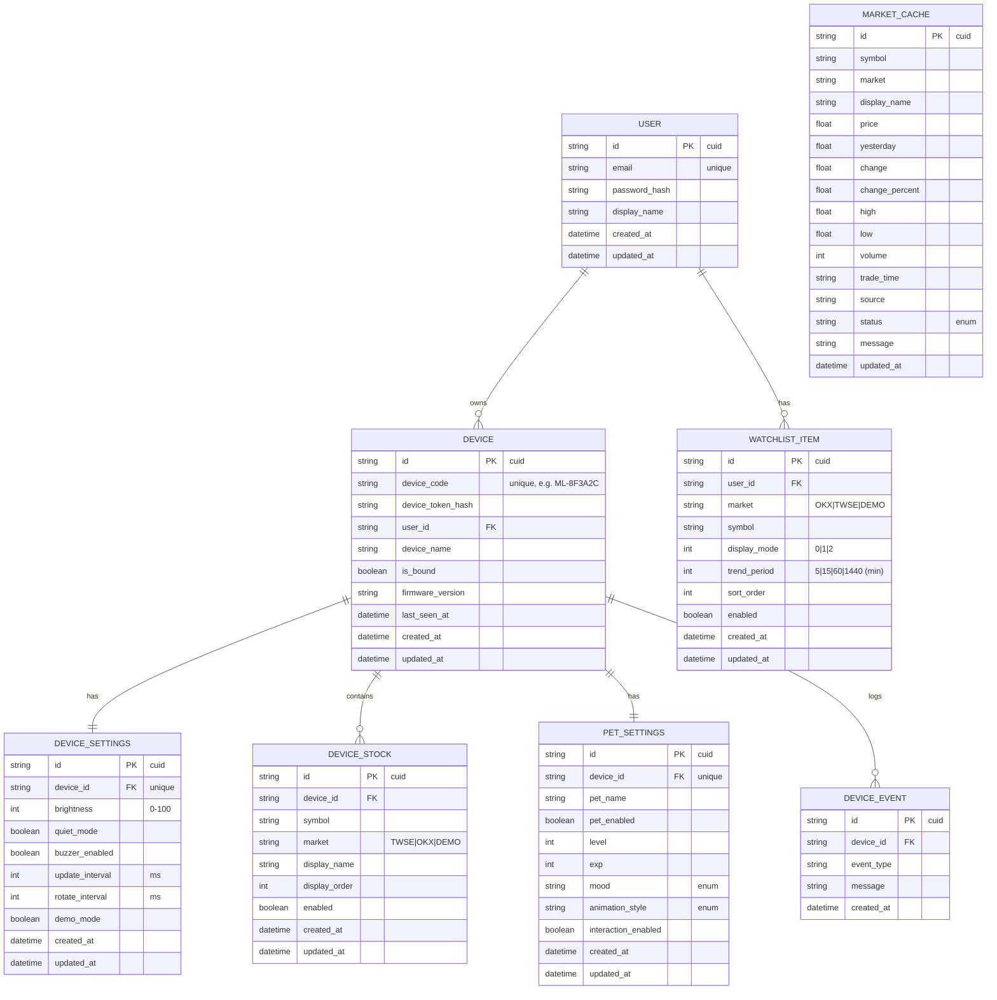

# 資料模型定義文件

> 命名慣例：JSON 欄位使用 `snake_case`，實體名稱（ER 圖）使用 `UPPER_SNAKE_CASE`。

---

## 1. 實體清單總覽

| 實體 | 說明 | 儲存位置 |
|------|------|---------|
| `USER` | 使用者帳號 | SQLite (Prisma) |
| `DEVICE` | ESP32 裝置 | SQLite (Prisma) |
| `DEVICE_SETTINGS` | 裝置顯示設定 | SQLite (Prisma) |
| `DEVICE_STOCK` | 裝置自選股票清單 | SQLite (Prisma) |
| `WATCHLIST_ITEM` | 單一自選項目（含 display_mode / trend_period） | SQLite (Prisma) |
| `PET_SETTINGS` | 市場小助手設定 | SQLite (Prisma) |
| `MARKET_CACHE` | 市場資料快取 | SQLite (Prisma) |
| `DEVICE_EVENT` | 裝置事件紀錄 | SQLite (Prisma) |

---

## 2. ER 圖



---

## 3. 實體詳細定義

### 3.1 USER

#### 欄位規格

| 欄位 | 型別 | 必填 | 預設值 | 驗證規則 | 說明 |
|------|------|------|--------|---------|------|
| `id` | `string` | ✅ | `cuid()` | cuid 格式 | 主鍵 |
| `email` | `string` | ✅ | — | email 格式，唯一 | 登入帳號 |
| `password_hash` | `string` | ✅ | — | 非空字串 | bcrypt hash |
| `display_name` | `string` | ❌ | `null` | max 50 | 顯示名稱 |
| `created_at` | `datetime` | ✅ | `now()` | ISO 8601 | 建立時間 |
| `updated_at` | `datetime` | ✅ | `now()` | ISO 8601 | 更新時間 |

#### JSON Schema

```json
{
  "$schema": "http://json-schema.org/draft-07/schema#",
  "title": "User",
  "type": "object",
  "required": ["id", "email", "password_hash", "created_at", "updated_at"],
  "properties": {
    "id": { "type": "string", "description": "cuid" },
    "email": { "type": "string", "format": "email" },
    "password_hash": { "type": "string", "minLength": 1 },
    "display_name": { "type": ["string", "null"], "maxLength": 50 },
    "created_at": { "type": "string", "format": "date-time" },
    "updated_at": { "type": "string", "format": "date-time" }
  },
  "additionalProperties": false
}
```

#### 範例資料

```json
[
  {
    "id": "clx1a2b3c0000qwer1234abcd",
    "email": "demo@marketlight.local",
    "password_hash": "$2b$10$...",
    "display_name": "Demo User",
    "created_at": "2026-05-29T13:00:00+08:00",
    "updated_at": "2026-05-29T13:00:00+08:00"
  }
]
```

---

### 3.2 DEVICE

#### 欄位規格

| 欄位 | 型別 | 必填 | 預設值 | 驗證規則 | 說明 |
|------|------|------|--------|---------|------|
| `id` | `string` | ✅ | `cuid()` | cuid | 主鍵 |
| `device_code` | `string` | ✅ | — | `ML-[A-Z0-9]{6}` 唯一 | 裝置識別碼 |
| `device_token_hash` | `string` | ❌ | `null` | — | 未來 token 驗證預留 |
| `user_id` | `string` | ❌ | `null` | FK → USER.id | 綁定使用者 |
| `device_name` | `string` | ✅ | `"Market Light"` | max 50 | 裝置名稱 |
| `is_bound` | `boolean` | ✅ | `false` | — | 是否已綁定 |
| `firmware_version` | `string` | ❌ | `null` | semver | 韌體版本 |
| `last_seen_at` | `datetime` | ❌ | `null` | ISO 8601 | 最後心跳時間 |
| `created_at` | `datetime` | ✅ | `now()` | ISO 8601 | — |
| `updated_at` | `datetime` | ✅ | `now()` | ISO 8601 | — |

#### 範例資料

```json
[
  {
    "id": "clx1device0000qwer1234abcd",
    "device_code": "ML-8F3A2C",
    "device_token_hash": null,
    "user_id": "clx1a2b3c0000qwer1234abcd",
    "device_name": "Market Light Desk",
    "is_bound": true,
    "firmware_version": "0.1.0",
    "last_seen_at": "2026-05-29T13:12:08+08:00",
    "created_at": "2026-05-29T13:00:00+08:00",
    "updated_at": "2026-05-29T13:12:08+08:00"
  }
]
```

---

### 3.3 DEVICE_SETTINGS

#### 欄位規格

| 欄位 | 型別 | 必填 | 預設值 | 驗證規則 | 說明 |
|------|------|------|--------|---------|------|
| `id` | `string` | ✅ | `cuid()` | — | 主鍵 |
| `device_id` | `string` | ✅ | — | FK → DEVICE.id，唯一 | 裝置外鍵 |
| `brightness` | `integer` | ✅ | `80` | 0–100 | OLED 亮度 |
| `quiet_mode` | `boolean` | ✅ | `false` | — | 安靜模式 |
| `buzzer_enabled` | `boolean` | ✅ | `true` | — | 蜂鳴器 |
| `update_interval` | `integer` | ✅ | `30000` | ≥5000 ms | 資料更新間隔 |
| `rotate_interval` | `integer` | ✅ | `45000` | ≥5000 ms | 股票輪播間隔 |
| `demo_mode` | `boolean` | ✅ | `false` | — | Demo 模式 |

---

### 3.4 WATCHLIST_ITEM（自選清單核心）

> 對應 `需求.txt` 的自選清單 JSON 格式需求。

#### 欄位規格

| 欄位 | 型別 | 必填 | 預設值 | 驗證規則 | 說明 |
|------|------|------|--------|---------|------|
| `id` | `string` | ✅ | `cuid()` | — | 主鍵 |
| `user_id` | `string` | ✅ | — | FK → USER.id | 所屬使用者 |
| `market` | `enum` | ✅ | — | `OKX\|TWSE\|DEMO` | 市場來源 |
| `symbol` | `string` | ✅ | — | max 20，非空 | 股票/幣對代號 |
| `display_mode` | `integer` | ✅ | `2` | `0\|1\|2` | 0=僅ESP32, 1=僅網站, 2=皆可 |
| `trend_period` | `integer` | ✅ | `1440` | `5\|15\|60\|1440` | 趨勢週期（分鐘）|
| `sort_order` | `integer` | ✅ | `0` | ≥0 | 顯示排序 |
| `enabled` | `boolean` | ✅ | `true` | — | 是否啟用 |
| `created_at` | `datetime` | ✅ | `now()` | ISO 8601 | — |
| `updated_at` | `datetime` | ✅ | `now()` | ISO 8601 | — |

> **trend_period 對照：** 5=5min、15=15min、60=1H、1440=24H

#### JSON Schema

```json
{
  "$schema": "http://json-schema.org/draft-07/schema#",
  "title": "WatchlistItem",
  "description": "使用者自選股票/幣對清單項目",
  "type": "object",
  "required": ["id", "user_id", "market", "symbol", "display_mode", "trend_period", "sort_order", "enabled"],
  "properties": {
    "id": { "type": "string" },
    "user_id": { "type": "string" },
    "market": { "type": "string", "enum": ["OKX", "TWSE", "DEMO"] },
    "symbol": { "type": "string", "minLength": 1, "maxLength": 20 },
    "display_mode": { "type": "integer", "enum": [0, 1, 2] },
    "trend_period": { "type": "integer", "enum": [5, 15, 60, 1440] },
    "sort_order": { "type": "integer", "minimum": 0 },
    "enabled": { "type": "boolean" },
    "created_at": { "type": "string", "format": "date-time" },
    "updated_at": { "type": "string", "format": "date-time" }
  },
  "additionalProperties": false
}
```

#### 範例資料（對應 needs.txt 的 JSON 格式）

```json
[
  {
    "id": "clx1watch0001qwer1234abcd",
    "user_id": "clx1a2b3c0000qwer1234abcd",
    "market": "OKX",
    "symbol": "BTC/USDT",
    "display_mode": 1,
    "trend_period": 1440,
    "sort_order": 0,
    "enabled": true,
    "created_at": "2026-05-29T13:00:00+08:00",
    "updated_at": "2026-05-29T13:00:00+08:00"
  },
  {
    "id": "clx1watch0002qwer1234abcd",
    "user_id": "clx1a2b3c0000qwer1234abcd",
    "market": "OKX",
    "symbol": "ETH/USDT",
    "display_mode": 1,
    "trend_period": 1440,
    "sort_order": 1,
    "enabled": true,
    "created_at": "2026-05-29T13:00:00+08:00",
    "updated_at": "2026-05-29T13:00:00+08:00"
  },
  {
    "id": "clx1watch0003qwer1234abcd",
    "user_id": "clx1a2b3c0000qwer1234abcd",
    "market": "TWSE",
    "symbol": "2330",
    "display_mode": 2,
    "trend_period": 60,
    "sort_order": 2,
    "enabled": true,
    "created_at": "2026-05-29T13:00:00+08:00",
    "updated_at": "2026-05-29T13:00:00+08:00"
  }
]
```

#### API 序列化格式（對應 needs.txt）

未登入時回傳 DEMO 預設資料；登入後回傳使用者自選清單，序列化為：

```json
{
  "display_mode": 1,
  "market": "OKX",
  "symbols": ["BTC/USDT", "ETH/USDT"],
  "trend_period": 24
}
```

> **注意：** `trend_period` 在 API 輸出時換算為小時（÷60），在資料庫儲存時使用分鐘（minute）。

---

### 3.5 DEVICE_STOCK

| 欄位 | 型別 | 必填 | 預設值 | 說明 |
|------|------|------|--------|------|
| `id` | `string` | ✅ | `cuid()` | 主鍵 |
| `device_id` | `string` | ✅ | — | FK → DEVICE.id |
| `symbol` | `string` | ✅ | — | 代號，max 20 |
| `market` | `enum` | ✅ | — | `TWSE\|OKX\|DEMO` |
| `display_name` | `string` | ✅ | — | 顯示名稱，max 20 |
| `display_order` | `integer` | ✅ | `0` | 輪播順序 |
| `enabled` | `boolean` | ✅ | `true` | 是否啟用 |

#### 範例資料

```json
[
  { "id": "clx1stock001", "device_id": "clx1device0000qwer1234abcd", "symbol": "2330", "market": "TWSE", "display_name": "TSMC", "display_order": 0, "enabled": true },
  { "id": "clx1stock002", "device_id": "clx1device0000qwer1234abcd", "symbol": "BTC-USDT", "market": "OKX", "display_name": "BTC", "display_order": 4, "enabled": true }
]
```

---

### 3.6 PET_SETTINGS

| 欄位 | 型別 | 必填 | 預設值 | 驗證規則 | 說明 |
|------|------|------|--------|---------|------|
| `id` | `string` | ✅ | `cuid()` | — | 主鍵 |
| `device_id` | `string` | ✅ | — | FK，唯一 | 裝置外鍵 |
| `pet_name` | `string` | ✅ | `"Market Pet"` | max 20 | 寵物名稱 |
| `pet_enabled` | `boolean` | ✅ | `true` | — | 是否啟用 |
| `level` | `integer` | ✅ | `1` | ≥1 | 等級 |
| `exp` | `integer` | ✅ | `0` | ≥0 | 經驗值 |
| `mood` | `enum` | ✅ | `"normal"` | `calm\|up\|up_alert\|down\|down_alert\|error\|closed\|quiet` | 當前心情 |
| `animation_style` | `enum` | ✅ | `"simple"` | `simple\|cute\|minimal` | 動畫風格 |
| `interaction_enabled` | `boolean` | ✅ | `true` | — | 互動功能 |

---

### 3.7 MARKET_CACHE

| 欄位 | 型別 | 必填 | 預設值 | 說明 |
|------|------|------|--------|------|
| `id` | `string` | ✅ | `cuid()` | 主鍵 |
| `symbol` | `string` | ✅ | — | 代號 |
| `market` | `string` | ✅ | — | 來源 |
| `display_name` | `string` | ✅ | — | 顯示名稱 |
| `price` | `float` | ✅ | — | 最新價 |
| `yesterday` | `float` | ❌ | `null` | 昨收 |
| `change` | `float` | ✅ | — | 漲跌額 |
| `change_percent` | `float` | ✅ | — | 漲跌幅% |
| `high` | `float` | ❌ | `null` | 最高 |
| `low` | `float` | ❌ | `null` | 最低 |
| `volume` | `integer` | ❌ | `null` | 成交量 |
| `trade_time` | `string` | ❌ | `null` | 成交時間 |
| `source` | `string` | ✅ | — | `TWSE\|OKX\|DEMO` |
| `status` | `enum` | ✅ | — | MarketStatus |
| `message` | `string` | ❌ | `null` | 附加訊息 |
| `updated_at` | `datetime` | ✅ | `now()` | 快取更新時間 |

> **唯一索引：** `(symbol, market)` 組合唯一。

---

### 3.8 DEVICE_EVENT

| 欄位 | 型別 | 必填 | 說明 |
|------|------|------|------|
| `id` | `string` | ✅ | 主鍵 |
| `device_id` | `string` | ✅ | FK → DEVICE.id |
| `event_type` | `string` | ✅ | 如 `button_next`、`heartbeat`、`api_error` |
| `message` | `string` | ❌ | 附加說明 |
| `created_at` | `datetime` | ✅ | 事件時間 |

---

## 4. 資料驗證規則

### 通用規則
- 所有 `id` 欄位不可為空字串 `""`
- 所有 `enum` 欄位必須為列舉值之一，不接受其他字串
- `created_at` / `updated_at` 必須為合法 ISO 8601 格式

### WATCHLIST_ITEM 業務規則
- `symbol` 不可為空字串，OKX 格式為 `XXX/USDT`，TWSE 格式為數字代號
- `display_mode` 只允許 `0`、`1`、`2`
- `trend_period` 只允許 `5`、`15`、`60`、`1440`（分鐘）
- 同一 `user_id` 下，`(market, symbol)` 組合不可重複
- 未登入使用者不可寫入，只能讀 DEMO 預設資料

### DEVICE_STOCK 業務規則
- 同一 `device_id` 下，`(market, symbol)` 組合不可重複
- `display_order` 在同一裝置下應連續（0, 1, 2, ...）

### DEVICE_SETTINGS 業務規則
- `brightness` 必須在 0–100 之間
- `update_interval` 和 `rotate_interval` 最小值為 5000ms
- 每台裝置只能有一筆 DeviceSettings（一對一關係）

### MARKET_CACHE 業務規則
- `change_percent` 計算：`(price - yesterday) / yesterday * 100`
- OKX 的 `change_percent`：`(last - open24h) / open24h * 100`
- `status` 判斷規則：
  - API 錯誤 → `error`
  - 休市 → `closed`
  - `|changePercent| < 0.5` → `calm`
  - `changePercent >= 1.5` → `up_alert`
  - `changePercent > 0` → `up`
  - `changePercent <= -1.5` → `down_alert`
  - `changePercent < 0` → `down`

---

## 5. 儲存策略與索引

### 儲存位置
- **主要資料庫：** SQLite（via Prisma），路徑 `prisma/dev.db`
- **未登入狀態：** 前端直接使用 `lib/demo-data.ts` 靜態資料，不查 DB
- **MVP 認證：** localStorage mock auth（`lib/auth-mock.ts`）

### 索引設計

| 表格 | 索引欄位 | 用途 |
|------|---------|------|
| `User` | `email` (UNIQUE) | 登入查詢 |
| `Device` | `device_code` (UNIQUE) | 裝置綁定查詢 |
| `DeviceStock` | `device_id` | 取裝置股票清單 |
| `WatchlistItem` | `user_id` | 取使用者自選清單 |
| `WatchlistItem` | `(user_id, market, symbol)` (UNIQUE) | 防止重複 |
| `MarketCache` | `(symbol, market)` (UNIQUE) | 快取查詢與更新 |
| `DeviceEvent` | `device_id` | 事件查詢 |

### localStorage 結構（MVP mock auth）

```
key: "ml_auth_user"
value: JSON.stringify({
  id: string,
  email: string,
  display_name: string,
  token: "mock_token"
})
```

---

## 6. 資料流說明

```
[未登入]
  前端 → lib/demo-data.ts → 顯示 OKX + 台股 DEMO 資料

[已登入 - 自選清單]
  前端 → GET /api/web/watchlist
       → Prisma: WatchlistItem.findMany({ where: { user_id } })
       → 序列化為 { display_mode, market, symbols[], trend_period }
       → 前端渲染

[已登入 - 修改自選]
  前端 → POST /api/web/watchlist
       → 驗證 display_mode / trend_period / symbol 格式
       → Prisma: WatchlistItem.upsert(...)
       → 回傳更新後清單

[ESP32 - 取設定]
  ESP32 → GET /api/device/config
        → Prisma: Device + DeviceSettings + DeviceStock + PetSettings
        → 回傳完整 JSON 設定

[ESP32 - 取市場資料]
  ESP32 → GET /api/device/market
        → Prisma: MarketCache.findMany(...)
        → 若快取過期 → 重新 fetch TWSE/OKX → 更新 MarketCache
        → 回傳 items[]

[市場資料更新]
  Server → fetchTWSE() / fetchOKX()
         → normalize → MarketData
         → Prisma: MarketCache.upsert({ where: { symbol_market } })
```

---

*文件版本：v1.0 | 建立時間：2026-05-29*
